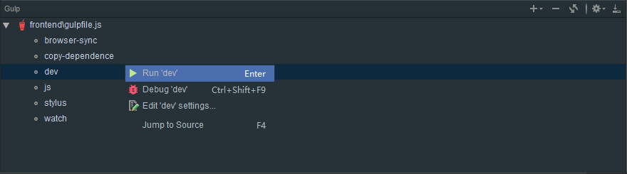

# 六六脑V2.0前端开发
## 目录结构
- `cmd` 常用可执行文件目录
- `doc` 系统文档目录
- `src` 源文件目录
- `dest` 构建后的目录
- `node_modules` 依赖文件目录

## 初次使用
参照[kf.66nao.com.conf](./kf.66nao.com.conf)在`nginx`中新增一个`server`（最简单的就是复制一份到自己的`nginx`配置文件里面）。  
运行`cmd/setup.bat`文件，windows用户可直接双击运行。
## 开发时环境
要求开启IDE的`jshint`代码检查（可参照[IDE配置](./doc/IDE配置.md)），然后命令行执行
```shell
gulp dev
```
或者右键`gulpfile.js`，选择`Show Gulp Tasks`（要求全局安装gulp），在任务中右键`dev`，选择`Run 'dev'`（建议使用此种方式）。

## 发布版本
运行`cmd/release.bat`文件，会自动构建生成`dest`目录，该目录即为构建后用于发布的目录。
